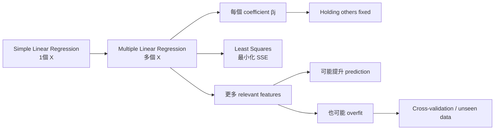
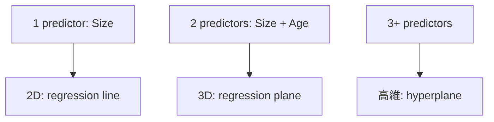
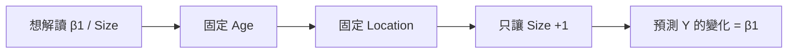
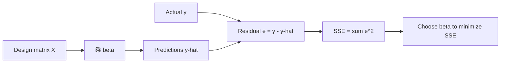

# Multiple Linear Regression

> [!info] Learning position
> Supervised Learning → Module 2 → Topic 4

## Multiple_Linear_Regression_究極詳細筆記

# Multiple Linear Regression — 圖文並茂究極詳細筆記
**來源**：University of Colorado Boulder, Supervised Learning — *Multiple Linear Regression*（13 頁 PDF + 配套影片逐字稿）。
> 本筆記以課件內容為主。標記為「課外補充」的內容，是為了幫助理解而加入的統計 / ML 背景，不代表投影片原文。
## 0. 先用 30 秒看懂整章

**最重要公式**：

`Y = β₀ + β₁X₁ + β₂X₂ + ... + βₚXₚ + ε`

**最重要翻譯**：`βⱼ` = 在其他 predictors 保持不變時，`Xⱼ` 增加 1 單位，`Y` 的預測改變多少。
---

## Page 1 — Multiple Linear Regression：課程定位與主題
### 一句話核心
這一頁不是在教公式，而是在告訴你：接下來會把「一個 X 預測 Y」升級成「很多個 X 一起預測同一個 Y」。
### 投影片 / 影片在教什麼
- 課程主題是 Multiple Linear Regression，屬於 Supervised Learning。
- 重點仍然是 regression：目標 Y 是連續數值，例如房價、銷售額、油耗。
- 它不是另一套完全不同的模型，而是 Simple Linear Regression 的自然延伸。

### 淺白詳細拆解
- 你可以把整個章節理解成：Simple Linear Regression 只有一條「解釋軸」；Multiple Linear Regression 同時放入多個解釋因素。
- 例如房價不只由面積決定，也可能受到屋齡、地點、房間數等因素影響。因此更接近現實世界。

### ⚠️ 常見誤解
不要因為名字有 multiple 就以為有多個 Y。Multiple 指的是多個 predictor / feature，outcome Y 仍然只有一個。

*Source: Multiple Linear Regression PDF, p. 1.*
---

## Page 2 — 本片學習地圖：你要掌握的 6 個核心
### 一句話核心
第 2 頁其實是一張 syllabus：模型怎樣擴展、公式怎樣看、係數怎樣解釋、為何更準、怎樣判斷 feature 重要、以及怎樣避免模型太複雜。
### 投影片 / 影片在教什麼
- 由 simple regression 擴展到 multiple regression。
- 理解 multiple regression equation。
- 掌握最重要句子：holding others fixed。
- 理解多個 predictors 對 prediction accuracy 的好處。
- 學習 feature importance 的基本判斷方法。
- 連到 real-world applications 與 model selection。

### 淺白詳細拆解
- 這 6 點其實有一條因果鏈：加入更多 X → 每個 β 有「條件式」含義 → 模型能解釋更多 variation → 但要判斷哪些 X 真正有用 → 最後要用 validation 防 overfitting。
- 所以不要把每一頁分散背誦；要把它們看成同一個模型生命週期。

### ⚠️ 常見誤解
只背公式但不理解 holding others fixed，通常是學 Multiple Regression 最大的斷點。

*Source: Multiple Linear Regression PDF, p. 2.*
---

## Page 3 — From Simple to Multiple Predictors：從一條線到平面
### 一句話核心
Simple regression 是 Y = β₀ + β₁X + ε；Multiple regression 只是再加 β₂X₂、β₃X₃……，讓多個因素同時參與預測。
### 投影片 / 影片在教什麼
- Simple Linear Regression：只有一個 predictor X。
- Multiple Linear Regression：有 X₁, X₂, …, Xₚ 多個 predictors。
- 房價例子由「size only」擴展成 size + location + age。
- 影片口述補充：一個 predictor 時，幾何上是 2D 的 line；兩個 predictors 時是 3D 的 plane；更多 predictors 時稱 hyperplane。

### 淺白詳細拆解
- 公式：Y = β₀ + β₁X₁ + β₂X₂ + … + βₚXₚ + ε。每增加一個 predictor，就增加一個對應 coefficient β。
- 為什麼仍叫 linear？因為模型把 predictors 以「係數 × feature 再相加」的線性方式組合；在兩個 X 的情況，預測面是一個平面。
- 注意 p 是 predictor 的數量；n 通常是 observations / rows 的數量。這兩個符號之後在 matrix notation 很重要。

### 例子
如果 Y=房價，X₁=面積，X₂=屋齡，X₃=地點，那模型是在同一時間考慮三者，而不是先做三條完全獨立的 regression。

### 圖解（可在支援 Mermaid 的 Markdown 閱讀器顯示）


### ⚠️ 常見誤解
Multiple Linear Regression 不是把三個 simple regressions 疊在一起；所有 β 是在同一個共同模型中一起估計。

*Source: Multiple Linear Regression PDF, p. 3.*
---

## Page 4 — The Multiple Regression Equation：每一個符號是什麼
### 一句話核心
這一頁要做的只是把公式拆開：Y 是你想預測的結果；X 是輸入；β 是模型學到的權重；ε 是模型未能解釋的部分。
### 投影片 / 影片在教什麼
- Y：target / outcome。
- X₁, X₂, …, Xₚ：predictor variables / features。
- β₀：intercept；β₁, …, βₚ：每個 predictor 的 coefficient。
- ε：error term。

### 淺白詳細拆解
- β₀ 可以理解為「所有 X 都等於 0 時，模型的基準值」。但是否有實際意義要看 X=0 是否合理。
- βⱼ 的正負號告訴你方向：βⱼ>0 表示 Xⱼ 增加時，Y 的預測傾向增加；βⱼ<0 表示傾向下降——前提是其他 predictors 固定。
- 課外補充：理論式寫 ε；在手上已有資料並完成擬合後，我們常寫 residual eᵢ = yᵢ − ŷᵢ。ε 是理論誤差，residual 是觀察到的「實際 − 預測」。

### 例子
若 β₂ = −2000 而 X₂ 是屋齡，代表屋齡每增加 1 年，模型預測價格下降 $2,000（其他條件不變）。

### ⚠️ 常見誤解
不要把 β 當作固定的自然定律。它是根據資料、features、樣本與模型假設估計出來的。

*Source: Multiple Linear Regression PDF, p. 4.*
---

## Page 5 — Key Concept — Holding Others Fixed：Multiple Regression 的靈魂
### 一句話核心
你要看 X₁ 的影響，就只讓 X₁ 改變；X₂、X₃……全部「按住不動」。因此 β₁ 是 X₁ 的 partial / conditional effect。
### 投影片 / 影片在教什麼
- 課件定義：β₁ = X₁ 增加 1 單位時 Y 的變化，而 X₂, X₃, … 保持固定。
- 左圖：固定不同屋齡，再看 size 對 price 的關係；每條線都是正斜率。
- 右圖：固定不同 size，再看 age 對 price 的關係；每條線都是負斜率。
- 圖中同方向而近似平行的線，反映這個 basic additive model 沒有加入 interaction term。

### 淺白詳細拆解
- 這個概念之所以重要，是因為現實中的 predictors 常常一起變。例如大屋可能也有更多 bedrooms。如果你只看 size vs price，size 可能「順便帶著 bedrooms 的效果」。
- Multiple regression 嘗試問一個更精確的問題：「假設兩間屋其他條件相同，只差 1 sq ft，價格平均差多少？」這就是 β₁ 的意思。
- 因此 β₁ 不是單純 correlation；它是模型條件下、控制其他 features 後的關聯。

### 例子
想比較 2000 sq ft 與 2001 sq ft 的兩間屋：若 age 和 location 完全相同，β₁ 就是模型預測的價格差。

### 圖解


### ⚠️ 常見誤解
holding fixed 是數學/模型上的比較，不代表現實世界中你真的能找到兩個其他條件 100% 一樣的樣本。

*Source: Multiple Linear Regression PDF, p. 5.*
---

## Page 6 — House Price Example：把 β 變成真正可以讀的句子
### 一句話核心
這頁用數字把係數翻譯成人話：每 +1 sq ft → +$110；每老 1 年 → −$2,000；premium location → +$50,000，全部都要加上「其他條件相同」。
### 投影片 / 影片在教什麼
- β₁ = $110：每增加 1 sq ft，price +$110（same age/location）。
- β₂ = −$2,000：每增加 1 年屋齡，price −$2,000（same size/location）。
- β₃ = $50,000：premium location 相對於 baseline location +$50,000（same size/age）。

### 淺白詳細拆解
- Location 多半是 categorical variable，所以實作上通常會編碼成 0/1 dummy variable。若 Location=1 代表 premium，Location=0 是 baseline，β₃ 就是兩種 location 的預測差。
- 這頁沒有給 β₀，所以不能從課件直接算「一間特定房屋的完整 predicted price」。但是我們可以算兩間屋之間的差異，因為 intercept 在相減時會消失。

### 例子
兩間屋 B 相比 A：面積多 200 sq ft、屋齡多 5 年，而且 B 在 premium location。預測差 = 200×110 + 5×(−2000) + 50000 = +$62,000。

### ⚠️ 常見誤解
β₃=$50,000 不是「location 每增加 1 單位」這麼直觀，因為 categorical variable 的 1 單位通常代表從 baseline category 切換到另一 category。

*Source: Multiple Linear Regression PDF, p. 6.*
---

## Page 7 — Why Multiple Predictors? — Improved Prediction
### 一句話核心
只用 size 會漏掉 age、location 等資訊；加入真正相關的 features 後，predictions 往往更貼近真實值，殘差變小。
### 投影片 / 影片在教什麼
- 課件指出 relevant features 通常能提升 predictive accuracy。
- 單一 predictor 可能漏掉重要 relationships。
- 多個 predictors 可以解釋更多 Y 的 variation。
- 頁面示例圖中，size-only 的 R² 約 0.83，而 size + age + location 約 0.94。

### 淺白詳細拆解
- R² 可以粗略理解為：模型解釋了 Y 變異的多少比例。0.83 表示約 83% 的 variation 在這個示例中由模型解釋；0.94 則更高。
- 「更高的 R²」通常意味 training fit 更好，但這不是保證模型在新資料一定更好。因此第 12 頁會提醒 overfitting。
- 從圖形看，multiple-predictor model 的點更貼近理想預測關係，表示 errors / residuals 更小。

### 例子
若兩間屋 size 一樣，但一間 5 年、一間 40 年；size-only model 可能給出很接近的價格，而 multiple model 可以利用 age 拉開預測。

### ⚠️ 常見誤解
不是「feature 越多越好」，而是「有用、可泛化的 feature」越多越可能幫助。垃圾 feature 也可能令模型更差。

*Source: Multiple Linear Regression PDF, p. 7.*
---

## Page 8 — Unique Contributions：把互相纏在一起的 predictors 拆開看
### 一句話核心
當 size 和 bedrooms 彼此相關，simple regression 容易混淆二者；multiple regression 會在同一模型中控制另一個 predictor，估計每個變數的獨特貢獻。
### 投影片 / 影片在教什麼
- 問題：predictors can be correlated with each other。
- 單一 predictor 的模型可能 confuse their effects。
- Multiple regression 透過 controls for other predictors 來看各變數的 contribution。
- 課件例子：bigger houses → more bedrooms，因此 size 和 bedrooms 有 correlation。

### 淺白詳細拆解
- 假設 bedroom 多的房子通常也更大。若只做 Price ~ Bedrooms，bedrooms coefficient 可能同時吸收「更大面積」帶來的影響。
- 加入 Size 後，Bedrooms coefficient 變成：「在 size 一樣的情況下，多一間 bedroom 還會帶來多少價格差？」這就是 unique / partial contribution。
- 課外補充：如果兩個 predictors 高度相關，會出現 multicollinearity，令個別 coefficients 的估計變得不穩定、標準誤變大。Multiple regression 不會神奇地消除這個統計問題。

### 例子
兩間同樣 2000 sq ft 的屋，一間 3 bedrooms、一間 4 bedrooms。此時 bedrooms coefficient 比單純比較所有 3 房與 4 房的平均價格更接近「房間數本身」的條件式關聯。

### ⚠️ 常見誤解
課件用 “true effect” 作直觀說法；更嚴謹地說，multiple regression 估計的是「在模型與假設下的 partial association」。沒有實驗/因果設計時，不要自動把 coefficient 當成 causal effect。

*Source: Multiple Linear Regression PDF, p. 8.*
---

## Page 9 — Evaluating Feature Importance：哪個 predictor 最有用？
### 一句話核心
不能只問「β 最大的是誰」。課件提出三條主線：係數大小、加入 feature 後 R² 提升多少、以及在 cross-validation / ablation 中拿掉 feature 會掉多少 performance。
### 投影片 / 影片在教什麼
- Coefficient magnitude：|β| 大，可能代表影響較強。
- R² improvement：加入某 feature 後 R² 提升多少。
- Cross-validation：有/沒有某 predictor 時，比較 unseen-fold performance。
- Feature ablation：移除 feature，看 performance drop。

### 淺白詳細拆解
- Coefficient magnitude 很直觀，但不同 feature 的單位不同時不宜直接比較。例如 size 用 sq ft、age 用 year；110 與 2000 的數字大小不能直接說 age 一定「更重要」。
- 若要比較 coefficients，可以先做 standardization，或改用 performance-based importance。
- Cross-validation / ablation 更貼近 ML 的問題：「這個 feature 對新資料 prediction 到底有沒有幫助？」而不只是看 training fit。

### 例子
拿掉 Age 後 CV RMSE 明顯變差，代表 Age 對泛化預測有實際貢獻；如果幾乎沒變，Age 可能是冗餘 feature。

### ⚠️ 常見誤解
原始 coefficient 的 absolute value 只有在 feature scale 有可比性時才適合直接比較。

*Source: Multiple Linear Regression PDF, p. 9.*
---

## Page 10 — Fitting Multiple Regression：Least Squares 完全沒有換核心
### 一句話核心
從 simple 到 multiple，最小平方法的目標不變：找一組 β，令所有 residual 的平方和 SSE = Σ(yᵢ−ŷᵢ)² 最小。唯一真正改變的是 X 由一欄變成很多欄。
### 投影片 / 影片在教什麼
- 與 simple regression 一樣使用 Least Squares。
- Minimize sum of squared residuals。
- 同時找最佳 β₀, β₁, …, βₚ。
- 軟體會輸出 coefficients、R²、predictions、residuals。

### 淺白詳細拆解
- 對第 i 筆資料，ŷᵢ = β₀ + β₁xᵢ1 + β₂xᵢ2 + … + βₚxᵢp。Residual eᵢ = yᵢ − ŷᵢ。
- Least Squares 把每個 eᵢ 平方，再加起來：SSE = Σeᵢ²。模型會選令這個數字最小的 coefficients。
- Matrix view：把每筆 observation 放成 X 的一列，每個 predictor 放成一欄，再加一欄 1 處理 intercept。於是 ŷ = Xβ。
- 課外補充：在條件適合時，closed-form normal equation 是 β̂=(XᵀX)⁻¹Xᵀy；實際數值軟體常以 QR / SVD 等方法提升穩定性。

### 例子
Simple regression 的 X 可能只有 [1, size] 兩欄；multiple regression 則是 [1, size, age, location] 四欄。Least Squares 的「目的」完全一樣。

### Matrix 流程圖


### ⚠️ 常見誤解
不要以為加入更多 predictors 就需要一套新的 loss function。基本 OLS 仍然是在最小化同一個 SSE。

*Source: Multiple Linear Regression PDF, p. 10.*
---

## Page 11 — Real-World Examples：為什麼 Multiple Regression 是很自然的 baseline
### 一句話核心
現實 outcome 幾乎都由多個因素共同決定，所以 multiple regression 是很多領域最自然的第一個 baseline model。
### 投影片 / 影片在教什麼
- Real Estate：size、age、location → house price。
- Healthcare：treatment、dosage、age → patient outcome。
- Marketing：channels、seasonality、pricing → sales。
- Transportation：engine size、weight → fuel efficiency。
- Environment：location、altitude、time → temperature。

### 淺白詳細拆解
- 這一頁的真正訊息不是記住五個行業，而是建立「多因素思維」：一個 outcome 通常不是由單一 X 決定。
- Linear regression 的優勢是容易解釋：你可以清楚看到每個 predictor 在 holding others fixed 下的 coefficient；因此即使之後用更複雜 ML，multiple regression 仍常被用作 baseline。

### 例子
Marketing 若只用 ad spend 預測 sales，可能把 Christmas season 的旺季效果錯算成廣告效果；加入 seasonality 後可以部分控制。

### ⚠️ 常見誤解
「多因素」不代表所有因素都應該塞入模型。變數必須有合理定義、資料品質與 validation 支持。

*Source: Multiple Linear Regression PDF, p. 11.*
---

## Page 12 — Model Selection & Overfitting：R² 變高不代表真的變好
### 一句話核心
加 predictors 幾乎可以讓 training fit 不變差，但太多 predictors 可能開始記住 noise；所以模型好不好要看 unseen data，而不是只看 training R²。
### 投影片 / 影片在教什麼
- 課件：Adding more predictors generally improves fit on training data (R² increases)。
- 風險：too many predictors → overfitting。
- 使用 domain knowledge 選 meaningful predictors。
- 在 unseen data 驗證 performance。
- 在 complexity 與 interpretability 之間取得平衡。

### 淺白詳細拆解
- 為什麼 training R² 幾乎不會因加入普通 predictor 而下降？因為新模型至少可以把新 coefficient 設成 0，退回舊模型；因此它的可選空間只會更大。
- 但 test / validation performance 可能先改善、之後惡化：新 variables 開始吸收 training sample 的偶然 noise。
- 因此 ML 的正確判斷不是「training R² 最大」，而是「unseen-data error 最好，而且模型複雜度合理」。
- 課外補充：Adjusted R² 會對增加 predictors 加入懲罰，但在 predictive ML 中，cross-validation / held-out test 通常更直接。

### 例子
你有 100 筆房價資料卻加入 90 個弱相關 features，training R² 可能很漂亮，但新房屋的 prediction 可能很不穩定。

### ⚠️ 常見誤解
不要用 test set 一次又一次挑 features，否則 test set 也會被「間接 overfit」。通常用 train/validation/CV 做選擇，最後 test 做一次評估。

*Source: Multiple Linear Regression PDF, p. 12.*
---

## Page 13 — What We’ve Covered：把全片壓成一條主線
### 一句話核心
Multiple regression = 多個 X + 同一個 Y + 每個 β 都是 holding others fixed 的條件式影響 + 用 least squares 一起估計 + 用 validation 防 overfitting。
### 投影片 / 影片在教什麼
- Simple → Multiple：由一個 predictor 擴展到多個。
- Coefficient interpretation：holding others fixed。
- Benefits：prediction accuracy + unique contributions。
- Feature importance：coefficient / R² / CV / ablation。
- Real-world applications + model selection。

### 淺白詳細拆解
- 如果你只能記住一句：ŷ = β₀ + β₁X₁ + … + βₚXₚ，而且每個 βⱼ 都要讀成「其他 X 固定時，Xⱼ 增加 1 單位，ŷ 改變 βⱼ」。
- 如果你再多記一句：模型仍然用 least squares 找 coefficients，但加入 variables 後要更重視 correlation、feature selection、cross-validation 與 overfitting。

### ⚠️ 常見誤解
不要把「模型更複雜」等同「模型一定更好」。真正目標是能在新資料上穩定泛化。

*Source: Multiple Linear Regression PDF, p. 13.*
---

## 14. 全章公式表
| 概念 | 公式 / 表達 | 淺白意思 |
|---|---|---|
| Multiple regression | `Y = β₀ + Σ βⱼXⱼ + ε` | 多個 feature 的加權總和 + 誤差 |
| Prediction | `ŷᵢ = β₀ + β₁xᵢ1 + ... + βₚxᵢp` | 對第 i 筆資料算 predicted Y |
| Residual | `eᵢ = yᵢ - ŷᵢ` | 真實值減預測值 |
| SSE | `Σ(yᵢ - ŷᵢ)²` | 把所有誤差平方後相加 |
| Matrix prediction | `ŷ = Xβ` | 所有 observations 一次矩陣運算 |
| Normal equation（補充） | `β̂=(XᵀX)⁻¹Xᵀy` | 條件允許時的 closed-form OLS 解 |

## 15. 「Holding others fixed」終極理解
想像你有一個遊戲控制台：Size、Age、Location 各是一個旋鈕。要理解 Size 的 coefficient，你只轉 Size 這個旋鈕 +1，其他旋鈕全部不碰。螢幕上的 predicted price 改變多少，就是 β_size。

## 16. 5 個必考 / 必懂問題
**Q1. Multiple Linear Regression 的 “multiple” 指什麼？**  
A. 多個 predictors / features，不是多個 target Y。

**Q2. β₁ 要怎樣解讀？**  
A. X₁ 增加 1 單位時，Y 的預測改變 β₁，前提是其他 X 固定。

**Q3. 為什麼 multiple regression 可能比 simple regression 更準？**  
A. 因為能利用更多與 Y 有關的資訊，解釋更多 variation。

**Q4. Least Squares 在 multiple regression 有沒有變？**  
A. 核心沒有變，仍然 minimize SSE；只是同時估計更多 β。

**Q5. 為什麼不能無限加 features？**  
A. Training fit 可能一直變好，但會增加 overfitting，unseen-data performance 可能變差。

## 17. 一頁式 Final Mental Model
```text
現實世界：Y 通常受很多因素影響
        ↓
放入 X1, X2, ..., Xp
        ↓
Y ≈ β0 + β1X1 + ... + βpXp
        ↓
Least Squares 找最適合的一組 β
        ↓
每個 βj：holding other X fixed 的條件式影響
        ↓
更多 relevant X → 可能更準，也能拆解 unique contribution
        ↓
但 predictors 太多 / 太相關 → overfitting / multicollinearity
        ↓
用 domain knowledge + CV + unseen data 做 model selection
```

## Connections

[[Supervised Learning MOC]] · [[Supervised Learning - Module 2 MOC]] · [[Interpreting Results and Discussion]] · [[Polynomial Regression and Model Flexibility]]
